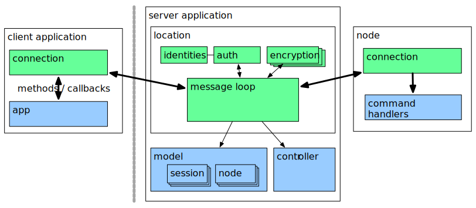

==============
Using Messidge
==============

Messidge is primarily for intermediating between a number of users ... who may be on the public Internet and who communicate over an authenticated and encrypted channel; and a number of nodes which are assumed to lie on a LAN or similar private network.

In the architecture diagram below, green are those components provided by Messidge, and blue are those that need to be implemented to use the library.

All objects are named by their public key (pk), and each connection onto the broker has a routing id (a rid, that you won't need to touch). A user can connect more than one instance, each of these being called a session; and nodes are assumed to have single instance per pk.

There are no network addresses - as far as a client (or a node) is concerned it is part of a traditional client/server setup and is only talking to the one server. It's all asynchronous but can be made to look synchronous if you need to; and it's simple to set up a long term 'channel' through which a service can send results whenever it needs to. It guarantees to deliver messages in order and only once. Best of all, it's designed to make all these things dead easy.

Let's go through the steps required to build a Messidge based application (which, btw, is in the 'demo' directory)...

A Basic Server
--------------

We need to implement: The Broker; The Model; The Controller; and a class that will be used to create user sessions. Messidge provides minimal implementations of each so it's a question of deriving from them. Let's build a sample server that: Centrally stores a series of notes provided by the client and; provides stateless nodes for adding and multiplying numbers together.

**The Broker**

The broker uses no persistent storage, but (ideally) a concept of identities will. Thus, the identities object is constructed outside of the broker to prevent abstraction leakage. For a similar reason the public and private keys for the broker are not stored by the broker itself and must be passed as part of the constructor. The model and controller are also expected to have been pre-created and the model needs to derive from MinimalModel. Creation of specialised instances is via callback and there are optional callbacks for user session creation and recovery (from a disconnection), and a pre-run callback for last minute initialisation.

Let's put it all together, starting with our specialisations...

The model is going to keep a list of notes provided by the client:

# model code

For now we're just going to log when a session is created:

# session code

**Why validate a claim?**

...the broker can clearly derive the user and session for a particular message due to it's source rid. However, a call that gets forwarded to another connection would need to have the user and session references added to each message - which would be huge overhead.
